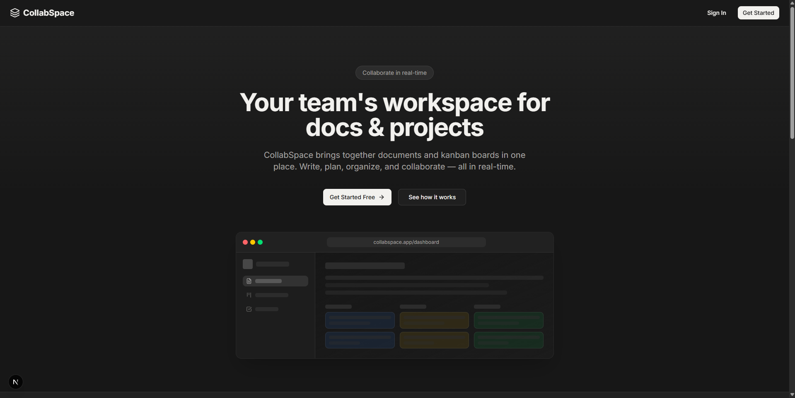
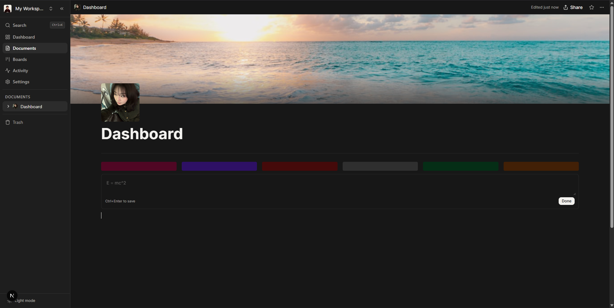
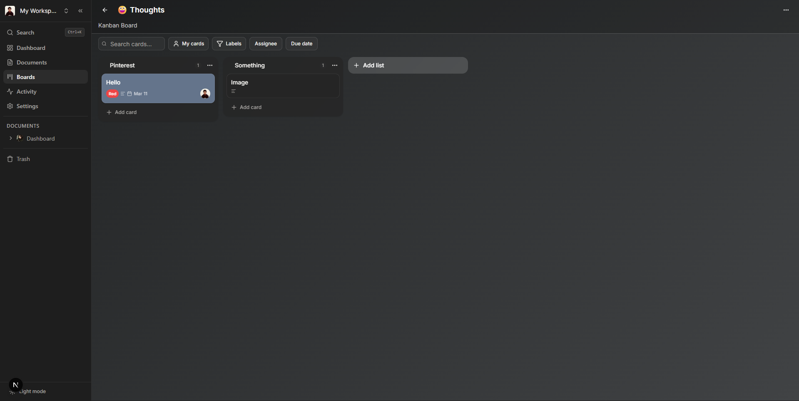

# CollabSpace

[](https://github.com/tatineeeeeee/CollabSpace/actions/workflows/ci.yml)


A real-time team collaboration workspace combining **Notion-style documents** with **Trello-style kanban boards**. Built with Next.js 16, Convex, and Clerk.

---

## Screenshots

| | |
|---|---|
|  |  |
| **Landing Page** — Hero, features, and CTA | **Document Editor** — Slash commands, 25+ block types |
|  | |
| **Kanban Board** — Drag-and-drop cards and lists | |

---

## Features

### Rich Text Editor (25+ Block Types)
- Slash command menu (`/`) with full block palette
- Headings, lists, tasks, quotes, code blocks with syntax highlighting
- Tables, callouts, toggles, multi-column layouts
- KaTeX math equations (block + inline)
- Image upload with captions and resize controls
- Audio/video embeds, bookmark link previews, PDF viewer
- File attachments, sub-pages, page mentions (`@`), user mentions (`#`)
- Toggleable headings with collapsible sections
- Table of contents (auto-generated)
- Version history with snapshot restore
- Export to Markdown, HTML, or plain text
- Document templates (Meeting Notes, Project Brief, Weekly Plan, etc.)

### Kanban Boards
- Drag-and-drop columns and cards with `@dnd-kit`
- Card labels, due dates, assignees, checklists, cover colors
- Card comments with real-time updates
- Filter bar: text search, "My cards" toggle, label/assignee/due date filters
- List header colors (10 presets)

### Collaboration & Organization
- Multi-workspace support with role-based access (owner/member)
- Real-time data sync via Convex subscriptions
- Activity feed tracking document and board actions
- Favorites/bookmarks per user
- Global search (`Cmd+K`)
- Nested document tree with drag-and-drop reordering
- Public document sharing with OG meta tags

### Design & UX
- Notion-inspired dark theme with warm gray palette
- Responsive layout (desktop sidebar + mobile sheet)
- Skeleton loading states for all data-fetching views
- Keyboard shortcuts throughout

---

## Tech Stack

| Layer | Technology |
|-------|-----------|
| **Framework** | [Next.js 16](https://nextjs.org/) (App Router, Server Components, React Compiler) |
| **Language** | TypeScript (strict mode) |
| **Database & Real-time** | [Convex](https://convex.dev/) |
| **Authentication** | [Clerk](https://clerk.com/) |
| **Styling** | [Tailwind CSS v4](https://tailwindcss.com/) |
| **UI Components** | [shadcn/ui](https://ui.shadcn.com/) (Radix UI primitives) |
| **Rich Text Editor** | [Tiptap](https://tiptap.dev/) (ProseMirror-based) |
| **Drag & Drop** | [@dnd-kit](https://dndkit.com/) |
| **State Management** | [Zustand](https://zustand.docs.pmnd.rs/) |
| **Package Manager** | [Bun](https://bun.sh/) |
| **Deployment** | Vercel + Convex Cloud |

---

## Architecture

```
app/
├── (marketing)/     Public landing page (Server Components)
├── (auth)/          Clerk sign-in/sign-up (split-screen layout)
├── (main)/          Authenticated app (protected by Clerk proxy)
│   ├── dashboard/   Recent boards & documents
│   ├── documents/   Document editor (Tiptap)
│   ├── boards/      Kanban boards (dnd-kit)
│   ├── activity/    Workspace activity feed
│   └── settings/    Workspace settings & members
└── (public)/        Published document preview

convex/              Serverless backend
├── schema.ts        10 tables with indexed queries
├── lib.ts           Shared auth + activity helpers
├── documents.ts     Document CRUD + search + versioning
├── boards.ts        Board management
├── cards.ts         Card operations + drag reorder
├── comments.ts      Card comments
└── ...              Users, workspaces, favorites, activities

components/
├── documents/       Editor + 25 Tiptap extensions
├── boards/          Kanban board + card dialog
├── shared/          Icon picker, search, confirm dialog
├── providers/       Convex + Clerk + theme wrappers
└── ui/              shadcn/ui components
```

---

## Notable Technical Decisions

### Custom Multi-Container Collision Detection
The kanban board uses a custom `collisionDetectionStrategy` (based on the official dnd-kit multi-container example) that handles cross-list card drags. It uses `pointerWithin` for container detection, drills down with `closestCenter` for card positioning, and caches the last valid `overId` to prevent flickering between containers.

### Optimistic Drag State with Server Reconciliation
During drag operations, cards are snapshotted into local state (`localCards`) and manipulated client-side. The `DragOverlay` suppresses its drop animation for cross-list moves (using `useState` instead of `useRef` because React Compiler caches stale ref values during render). Local state is cleared only after the server confirms the mutation via `useQuery` subscription, preventing snap-back to stale data.

### React 19.2 Patterns
The project uses `useEffectEvent` for non-reactive side effects in `useEffect` hooks (replacing the old `useRef` callback pattern). The React Compiler is enabled for automatic memoization — no manual `useMemo`/`useCallback` needed. All code follows the compiler's lint rules: no setState during render, no ref reads during render, no impure functions in memos.

### Security Hardening
All Convex mutations verify auth and workspace membership. Input bounds are enforced (title < 500 chars, content < 500KB, labels < 50, checklist items < 200). Cover image URLs are validated via `isSafeCoverValue()` to prevent CSS injection. Workspace deletion cascade-deletes all related data across 7 tables. Comment deletion re-verifies membership.

### Denormalized Activity Logging
Activities and comments store `userName`/`userImageUrl` at insert time via a shared `logActivity()` helper, eliminating N+1 joins on read-heavy pages like the activity feed.

---

## Getting Started

### Prerequisites
- [Bun](https://bun.sh/) (v1.3+)
- [Convex](https://convex.dev/) account
- [Clerk](https://clerk.com/) account

### Setup

1. **Clone and install dependencies:**
   ```bash
   git clone https://github.com/tatineeeeeee/CollabSpace.git
   cd collabspace
   bun install
   ```

2. **Set up environment variables:**
   ```bash
   cp .env.example .env.local
   ```
   Fill in your Convex and Clerk credentials (see `.env.example` for details).

3. **Set up Convex:**
   - Create a Convex project at [dashboard.convex.dev](https://dashboard.convex.dev)
   - Add `CLERK_JWT_ISSUER_DOMAIN` (with `https://` prefix) to Convex environment variables
   - Create a "convex" JWT Template in Clerk Dashboard

4. **Set up Clerk webhook** (for user sync):
   - Add endpoint: `https://<your-convex-deployment>.convex.site/webhooks/clerk`
   - Subscribe to: `user.created`, `user.updated`
   - Copy signing secret to Convex env vars as `CLERK_WEBHOOK_SECRET`

5. **Start development servers:**
   ```bash
   # Terminal 1 — Next.js
   bun run dev

   # Terminal 2 — Convex
   npx convex dev
   ```

6. **Open** [http://localhost:3000](http://localhost:3000)

---

## Scripts

| Command | Description |
|---------|-------------|
| `bun run dev` | Start Next.js dev server (Turbopack) |
| `npx convex dev` | Start Convex dev server |
| `bun run build` | Production build |
| `bun run lint` | Run ESLint |
| `bun run test` | Run unit tests (Vitest) |
| `bun run test:e2e` | Run E2E tests (Playwright) |
| `npx convex deploy` | Deploy Convex to production |

---

## Database Schema

10 tables with proper indexes on every query path:

| Table | Purpose |
|-------|---------|
| `users` | User profiles (synced from Clerk) |
| `workspaces` | Team workspaces |
| `workspaceMembers` | Membership + roles |
| `documents` | Rich text pages (Tiptap JSON) |
| `boards` | Kanban boards |
| `lists` | Board columns with sort order |
| `cards` | Cards with labels, checklists, assignees |
| `comments` | Card comments |
| `favorites` | User bookmarks |
| `activities` | Action audit log |
| `documentVersions` | Document version history |

---

## What I Learned

### Why Convex over Prisma/Drizzle
I chose Convex for its real-time subscriptions (`useQuery` auto-updates when data changes) and the elimination of a separate API layer. Trade-off: vendor lock-in and a smaller ecosystem. For a collaboration tool where real-time matters, the DX gain was worth it — no WebSocket setup, no cache invalidation, no React Query.

### React Compiler in Practice
Enabling `reactCompiler: true` caught several patterns I'd been writing for years. The compiler flagged `useRef` reads during render (stale values when cached), `setState` inside `useEffect` (should use `useEffectEvent`), and impure functions in `useMemo`. The biggest learning: `useState` is sometimes more correct than `useRef` when the value influences render output — refs get cached by the compiler and return stale values.

### The Hardest Bug: Drag-and-Drop Snap-Back
Cross-list card drags would visually snap back to their original position before jumping to the correct spot. Root cause: clearing optimistic local state (`localCards`) before the Convex `useQuery` subscription confirmed the server mutation. The fix was keeping local state alive until the server round-trips, and using `useEffectEvent` to safely clear it from a `useEffect` watching the query result. This also required `dropAnimation={null}` on the `DragOverlay` for cross-container moves, and the animation flag had to be `useState` (not `useRef`) because of the React Compiler caching issue above.

### Security Isn't Just Auth Checks
Adding `ctx.auth.getUserIdentity()` to every mutation was the easy part. The real lessons:
- **Cascade deletes need ordering** — deleting a workspace must clean up 7 related tables in the right order to avoid orphaned data.
- **Re-verify membership on deletion** — a user might have been removed from a workspace between creating a comment and deleting it.
- **CSS injection is real** — user-provided cover image URLs go into `background-image` CSS. Without `isSafeCoverValue()` whitelist validation, a malicious string could inject arbitrary styles.
- **Input bounds prevent DoS** — without limits on title length, label count, or content size, a single API call could store megabytes of data.

### What I'd Do Differently
- **Add E2E tests earlier** — unit tests for utilities were easy, but testing drag-and-drop and editor interactions end-to-end would have caught the snap-back bug faster.
- **Design the activity system upfront** — I added denormalized `userName`/`userImageUrl` fields after hitting N+1 query issues. Planning the read patterns before building would have saved a migration.
- **Accessibility from day one** — retrofitting aria attributes and keyboard navigation is harder than building them in. The editor extensions especially would benefit from being designed with screen readers in mind from the start.

---

## License

This project is for portfolio and educational purposes.
